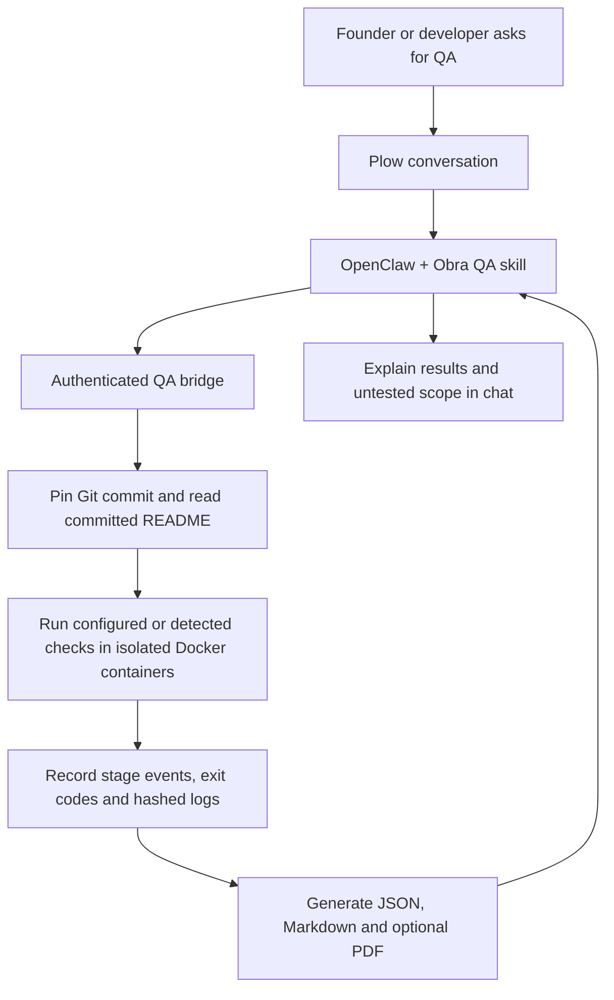

<div align="center">

# Obra QA
### Your team's QA engineer. In the conversation. Backed by evidence.

[](LICENSE)
[](https://github.com/plow-pbc/plow-openclaw-agent)
[](https://github.com/gilvanecesar/obra-qa/actions/workflows/validate.yml)

**A QA teammate for small software teams that ship faster than they can verify.**

[Try the demo](#try-it-in-three-commands) · [How it works](#from-a-request-to-evidence) · [Deploy](docs/DEPLOY.md) · [Português](docs/README.pt-BR.md)

</div>

---

## The job we want to fill

A developer ships a change. The founder asks whether it works. Someone has to translate that question into checks, run them against the right revision and explain what the evidence actually says.

**Obra QA owns that verification loop.** The team talks to an OpenClaw agent through Plow. It runs registered checks in isolated containers and returns traceable results, including a PDF. Every result points to a specific Git revision, command and evidence hash.

Built for the [AI Worth Using × OpenClaw 2.0 hackathon](https://luma.com/zhkhsnpa). The intended startup role is a QA engineer shared by the founder and developers. The group workflow still needs its multiplayer acceptance test.

> **Current release: working local prototype.** Chat-triggered audits and automatic PDF generation are verified. Public one-click installation is **not enabled**. Public GitHub link onboarding is available for JavaScript/npm projects. Automatic test creation, live progress messages and PDF delivery in chat are still being developed.

## Ask naturally

For a registered project:

> “QA, test AUTOMACAO. Show me what passed, what failed and what wasn't tested.”

Or in Portuguese:

> “QA, teste o AUTOMACAO e gere o relatório.”

The user does **not** need to copy a commit SHA. The server pins the project's committed `HEAD`; an explicit full SHA is also supported. Uncommitted changes are excluded.

Or send a public repository link:

> “QA, test https://github.com/gilvanecesar/obra-cockpit and generate the report.”

The bridge clones the public repository without account credentials, pins its default branch HEAD and discovers JavaScript syntax checks plus npm `test`, `lint`, `typecheck` and `build` scripts. Dependencies require a committed `package-lock.json`; they are prepared in a separate image with lifecycle scripts disabled. Checks execute offline. No project registration or commit copy/paste is needed.

This first automatic adapter supports JavaScript/npm. Private repositories, pull-request URLs, other package managers and other stacks are not yet supported by link onboarding. Repositories without a test script receive an **INCONCLUSIVE** overall result, even if syntax checks pass. Tests are discovered/reused, not generated. Functionality-based test generation remains planned.

## From a request to evidence



| Stage | What actually happens today |
|---|---|
| Understand | Read the registered project's committed README as untrusted context. |
| Prepare | Pin the revision and export tracked files into a disposable workspace. |
| Test | Reuse operator-configured checks or detect supported npm scripts; record each start and completion. |
| Explain | Review logs; separate observed behavior from unverified hypotheses. |
| Report | Save evidence and generate a PDF when ReportLab is configured. |

The event stream is available in job status. **Recording progress does not yet mean sending live notifications to the phone.** The agent can download the PDF; its final attachment delivery still needs end-to-end verification.

## Evidence from a real project

The first private pilot is **AUTOMACAO**, a Python/Selenium workflow connecting RD Station CRM and WhatsApp. Its source and customer data are not distributed here.

Four offline checks executed the committed message-sending method with browser doubles:

| Scenario | Observed result |
|---|---|
| Invalid-number dialog | Passed: sending was interrupted. |
| Missing message composer | Passed: sending was interrupted. |
| Incorrect destination tab | Assertion failed: the simulated CRM editor received Enter. |
| Delivery not confirmed | Assertion failed: the method returned success without observing confirmation. |

The last two checks express proposed safety requirements. They demonstrate behavior in simulation, **not incidents involving real customers**. No WhatsApp messages were sent and no CRM records were changed.

The runner currently labels nonzero exits `INCONCLUSIVE`; evidence review identifies whether an assertion or the environment failed. A passing check is not a product-wide approval.

## Why OpenClaw, Plow and a separate runner?

| Component | Responsibility |
|---|---|
| **OpenClaw** | Interpret requests, use the QA skill and explain evidence. |
| **Plow** | Connect the agent to conversations; the upstream channel supports groups. |
| **Latch** | Optional access to an owner's Mac tools. The current QA path uses its own bridge. |
| **QA bridge** | Authenticate requests, allowlist projects/checks and serialize execution. |
| **Docker runner** | Execute a pinned revision with resource limits and no network. |

The runtime image preserves the official Plow boot and usage reporter. It does not include a Docker socket, repository credentials or customer code.

### Multiplayer acceptance scenario

A founder defines the expected behavior in a trusted group. A developer identifies the registered project or revision. QA runs the checks, reports evidence to that group and records unresolved requirements. This scenario is designed but **not yet validated with two participants**. One installation serves one trusted team; it is not a boundary between hostile users.

## Try it in three commands

With Node.js 22+, Git and Docker installed, clone this repository and run:

```sh
npm test
docker build -f runner.Dockerfile -t obra-qa-runner .
node scripts/demo.mjs
```

No npm packages, Plow account or customer credentials are needed for this demo.

It creates a synthetic cross-tenant defect, executes the failing test, applies a correction and reruns the test. It also verifies timeout handling, a read-only root filesystem and absence of inherited agent credentials or the Docker socket. Evidence is saved in `runs/`.

For phone-based operation, follow [local setup](docs/SETUP.md). For public image packaging and one-click admission, use the [deployment guide](docs/DEPLOY.md).

## Published Docker image

The public conversational runtime was built from commit `296f117`. Download the tested immutable release with:

```sh
docker pull --platform linux/amd64 \
  ghcr.io/gilvanecesar/obra-qa@sha256:4c138cd04a46be2110e569f45ef09c5b48fb88c57e59bf0579b333ef78fdb363
```

This release targets **linux/amd64**. Specify the platform on Apple Silicon; a pull that defaults to ARM64 will fail. Docker Desktop uses emulation to run this image on Apple Silicon.

The image contains the OpenClaw conversational agent and QA client. It still needs Plow credentials and a separately configured QA executor; downloading it does not create a working standalone QA service. Follow [local setup](docs/SETUP.md) for a locally built agent with its own fixture, or [deployment configuration](docs/DEPLOY.md) for the published runtime's required inputs.

**Installation checks on 2026-09-25:** a fresh GitHub clone passed all six tests, the Docker regression/isolation/timeout demo, fixture setup and installation of ReportLab 4.4.3 in a new virtual environment. The published image was pulled with an empty Docker credential configuration. Docker layers could be cached; this was not a fresh-machine or end-to-end cloud installation test.

## One-click deployment: honest release status

**A public GHCR image is published and its anonymous download is verified. The install button is not live.**

The [official publishing process](https://aiworthusing.com/agent-index/publish) requires a public image, an Agent Index listing and an administrator enabling the first one-click deployment. More importantly, a new installation must have its own working executor: a cloud container cannot reach the developer's Mac using `host.docker.internal`.

Our [deployment guide](docs/DEPLOY.md) includes the architecture blocker, image release commands, registration steps, acceptance checklist and the exact handoff fields for the organizer. No decorative “Deploy” button points to an unavailable installation.

## What is ready?

| Capability | Status |
|---|---|
| Public MIT source | Available |
| Owner chat → OpenClaw → actual tests → reply | Verified locally |
| Revision pinning and authenticated project allowlist | Implemented and tested |
| Per-check execution events | Implemented; available through status |
| JSON, Markdown and PDF artifacts | Generated locally |
| PDF download into the agent | Verified |
| Fresh source setup and public image download | Verified locally; publication is manual |
| PDF attachment and live progress in chat | Pending end-to-end validation |
| Public GitHub link → JavaScript/npm checks | Implemented; obra-cockpit verified through running agent client |
| Generated functional tests and other stack adapters | Planned |
| Multiplayer pilot | Pending |
| Agent Index listing | Registered as a prototype |
| Real usage report | Accepted by Agent Index; automatic recurring reporting not yet verified |
| One-click admission and independent cloud install | Pending |
| Public demo video of at least 60 seconds | Pending |

## Execution boundaries

Checks run without network access, Linux capabilities, host credentials or the Docker socket. Containers use a read-only root filesystem, a non-root user and limits on CPU, memory, processes, output and execution time. Dependencies must be prepared in the runner image.

The operator controls the Docker daemon and registers commands. The OpenClaw runtime retains its upstream tools; only trusted teammates should share an installation. Repository text and test logs are data, never instructions. Jobs are in memory; artifacts persist but lookup endpoints are lost after a bridge restart.

## Project map

```text
src/                 QA runner, authenticated bridge and revision inventory
scripts/             Demo, local setup, agent client and PDF generator
openclaw/            Agent persona, skill and pinned runtime image
integrations/        Offline project-specific test adapters
test/                Behavioral tests
docs/                Setup, deployment and integration status
.github/workflows/   Validation and manually triggered image publishing
```

See [integration details](docs/INTEGRATION.md), [MIT license](LICENSE) and [third-party components](THIRD_PARTY.md).

The immutable image linked above predates repository-link onboarding. For the new client, build the current source using [local setup](docs/SETUP.md); the executor must also run the updated source.
