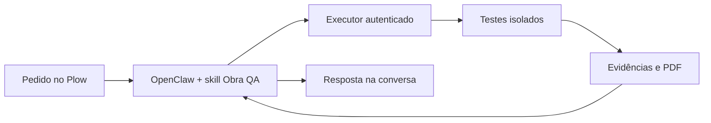

# Obra QA

**O QA da equipe, na conversa, com resultados sustentados por evidências.**

Você pede um teste pelo Plow. O OpenClaw entende a solicitação, usa a ferramenta de QA e explica o resultado. O executor separado fixa a revisão Git, executa os testes cadastrados em Docker e produz logs, eventos por etapa e PDF.

## Como pedir

> QA, teste o AUTOMACAO e mostre o que passou, o que falhou e o que ficou sem testar.

Para projetos cadastrados, não é necessário informar SHA. O servidor usa o último commit local e registra a revisão exata. Os testes ainda são preparados pelo operador; análise completa por link e criação automática de testes estão no plano de desenvolvimento.

## O que já foi validado

- Pedido real pelo telefone, execução via OpenClaw e resposta pelo Plow.
- Quatro cenários simulados do AUTOMACAO: dois passaram e dois reprovaram asserções.
- Eventos de início e conclusão por teste.
- Geração automática do PDF e download pelo agente.
- Seis testes automatizados e demonstração Docker com defeito sintético, correção e limites de execução.

O código privado do AUTOMACAO e os dados dos clientes não estão neste repositório. Nenhuma mensagem real foi enviada nos cenários simulados.

## O que falta para o hackathon

Validar o grupo com dois participantes, as atualizações ao vivo, o anexo PDF na conversa, o cadastro e uso no Agent Index, o vídeo e uma instalação independente com executor próprio.

**O deploy de um clique ainda não está ativo.** A imagem e o processo de publicação estão preparados; a organização precisa habilitar o primeiro deploy. Antes disso, temos de resolver como cada nova instalação conecta seu executor de testes.

[README completo](../README.md) · [Instalação local](SETUP.md) · [Preparação para deploy](DEPLOY.md)
