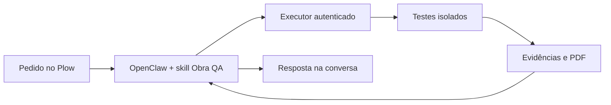

# Obra QA

**O QA da equipe, na conversa, com resultados sustentados por evidências.**

Você pede um teste pelo Plow. O OpenClaw entende a solicitação, usa a ferramenta de QA e explica o resultado. O executor separado fixa a revisão Git, executa os testes cadastrados em Docker e produz logs, eventos por etapa e PDF.



## Como pedir

> QA, teste o AUTOMACAO e mostre o que passou, o que falhou e o que ficou sem testar.

Para projetos cadastrados, não é necessário informar SHA. O servidor usa o último commit local e registra a revisão exata. Também é possível enviar a URL de um repositório público GitHub: o executor fixa o commit, verifica sintaxe JavaScript e detecta scripts npm de teste, lint, tipos e build. Dependências exigem package-lock.json. Sem testes existentes ou gerados, não há evidência funcional. Requisitos sem testes mantêm INCONCLUSIVE. O novo fluxo aprofundado permite ao agente inspecionar código versionado e criar testes Node vinculados a requisitos. Repositórios privados e adaptadores para outras stacks continuam pendentes.

## O que já foi validado

- Pedido real pelo telefone, execução via OpenClaw e resposta pelo Plow.
- Quatro cenários simulados do AUTOMACAO: dois passaram e dois reprovaram asserções.
- Eventos de início e conclusão por teste.
- Link público GitHub enviado no Plow, sem cadastro manual nem SHA: 12 arquivos do obra-cockpit verificados.
- Geração automática do PDF, download pelo agente e recebimento do anexo confirmado pelo proprietário em 25/09/2026.
- Oito testes automatizados e demonstração Docker com defeito sintético, correção e limites de execução.

O código privado do AUTOMACAO e os dados dos clientes não estão neste repositório. Nenhuma mensagem real foi enviada nos cenários simulados.

## O que falta para o hackathon

Validar o grupo com dois participantes, as atualizações ao vivo, o envio automático recorrente de uso ao Agent Index e uma instalação independente com executor próprio.

**O deploy de um clique ainda não está ativo.** A imagem pública foi publicada e baixada sem credenciais de registro; a organização precisa habilitar o primeiro deploy. Antes disso, temos de resolver como cada nova instalação conecta seu executor de testes.

[README completo](../README.md) · [Instalação local](SETUP.md) · [Preparação para deploy](DEPLOY.md)

## Imagem Docker e teste de instalação

```sh
docker pull --platform linux/amd64 \
  ghcr.io/gilvanecesar/obra-qa@sha256:4c138cd04a46be2110e569f45ef09c5b48fb88c57e59bf0579b333ef78fdb363
```

A imagem publicada usa **linux/amd64**. No Mac com Apple Silicon, informe a plataforma explicitamente; a execução depende da emulação do Docker Desktop. Ela contém o agente de conversa e o cliente de QA, mas exige credenciais Plow e um executor configurado separadamente.

Em 25/09/2026, uma cópia nova do GitHub passou nos seis testes, na demonstração Docker, na preparação do projeto sintético e na instalação do ReportLab 4.4.3 em um ambiente Python novo. O download da imagem foi validado sem credenciais de registro, com possível reaproveitamento de camadas locais. Isso não valida ainda uma instalação completa na nuvem. Um relatório de uso real foi aceito pelo Agent Index; o envio automático recorrente ainda precisa ser verificado.

Para usar o novo fluxo por link, reconstrua o agente e reinicie o executor com o código atual conforme SETUP.md. A imagem pública imutável acima é anterior a essa atualização.

Vídeo publicado: https://youtu.be/BV4GKwVrF2Y. Protocolo de análise aprofundada: [DEEP-ANALYSIS.md](DEEP-ANALYSIS.md).
